# Architecture

How a request or job flows through zdns-rest internals.

## Request / job workflow

```mermaid
flowchart TD
    subgraph ENTRY["HTTP entry"]
        A[Client] --> M["Middleware chain<br/>CORS → Logging → Auth → RateLimit → BodySize → Recover"]
        M --> R["mux.Router<br/>(MetricsMiddleware inside via r.Use,<br/>labels path with route template)"]
    end

    subgraph SYNC["Synchronous path — POST /job[/&#123;module&#125;]"]
        R --> RM["runModule<br/>parse JSON body or text lines,<br/>validateDomain per query"]
        RM --> VP["validateLookupParams<br/>empty / max / module exists"]
        VP --> CB{"circuit breaker<br/>CanExecute()"}
        CB -- open --> ERR503["ErrorResponse ErrCircuitBreakerOpen"]
        CB -- ok --> CC{"per-query cache.Get<br/>(fresh entries)"}
        CC -- "all cached" --> FLUSH["write collector.Ordered()<br/>+ Flush"]
        CC -- "some uncached" --> EQ
    end

    subgraph ASYNC["Asynchronous path — POST /jobs"]
        R --> CJ["createJobRequest<br/>validate + SubmitJob"]
        CJ --> JQ[("jobQueue<br/>bounded; full → job fails")]
        JQ --> JW["jm worker<br/>processJob"]
        JW --> JC{"job.ctx<br/>cancelled?"}
        JC -- yes --> CANC["status = cancelled"]
        JC -- no --> JCC{"per-query cache.Get"}
        JCC --> EQ
    end

    subgraph ENGINE["Shared lookupEngine"]
        EQ["executeQueries(ctx)<br/>workers = min(threads, queries)"]
        EQ --> W["per worker:<br/>zdns.InitResolver + defer Close()"]
        W --> LU["module.Lookup(ctx, ...)<br/>under moduleConfigMu.RLock<br/>(modules are process-global singletons)"]
        LU --> MR["marshalResult → NDJSON line<br/>v2 nested envelope (default)<br/>or v1 flat (--output-format=v1)"]
        MR --> CH[("results channel")]
    end

    subgraph SINK["Result collection"]
        CH --> RS["resultSink.consume<br/>extractResultMeta → collector.Add<br/>LogDNSLookup (metrics+log)<br/>cache.Set if isCacheableStatus<br/>(+ job progress via onResult)"]
    end

    subgraph SYNC2["Sync response tail"]
        RS --> EX{"executeQueries<br/>error?"}
        EX -- no --> WR["recordOutcome(true)<br/>write collector.Ordered() + Flush<br/>NDJSON to client"]
        EX -- yes --> SP{"servePartialResults<br/>buffered + stale cache entries"}
        SP -- "nothing to serve" --> ERR500["ErrorResponse ErrRunLookups<br/>recordOutcome(false)"]
    end

    subgraph JOBS2["Job lifecycle"]
        RS --> JS["job.Completed<br/>results = collector.Ordered()"]
        CANC --> JS
        JS --> CLIENT["GET /jobs/&#123;id&#125; → snapshot()<br/>GET /jobs/&#123;id&#125;/results → NDJSON<br/>DELETE /jobs/&#123;id&#125; → ctx cancel"]
    end

    subgraph DOWN["Shutdown (SIGINT/SIGTERM)"]
        SIG["srv.Shutdown (30s grace)"] --> JMS["jm.Stop(): cancel all job ctxs,<br/>close queue, workers exit"]
    end
```

## Key components

| Component | Role |
|-----------|------|
| `Server` | Owns an **immutable** `GlobalConf` snapshot taken under `GCMu`, the `lookupEngine`, `JobManager`, circuit breaker, and parsed trusted proxies. Handlers never read `GC` directly. |
| `lookupEngine` | Shared by sync and async paths. Holds the `zdns.ResolverConfig` and the initialized module map. `executeQueries` fans queries out to `min(threads, queries)` workers. |
| Per-worker `Resolver` | v2 resolvers carry mutable per-lookup state — each worker constructs its own (`InitResolver`) and `Close()`s it, which also frees recycled sockets. |
| `moduleConfigMu` | `cli.GetLookupModule` returns **process-global singletons**; `CLIInit` mutates fields `Lookup` reads. Write-locked during module init (server construction), read-locked per lookup — lookups stay parallel, re-init waits for in-flight calls. |
| `resultSink` | Single consumer of the workers' result channel for both paths: ordered buffering, DNS metrics/logging, and cache writes (only `NOERROR`/`NXDOMAIN`/`NODATA`/`NORECORD`/`NO_ANSWER` — transient failures are never replayed). |
| `OrderedResultCollector` | Buffers worker output keyed by query so responses keep input order despite out-of-order completion; `Pop` drains one buffered result per query for the partial/stale fallback. |
| `JobManager` | Bounded `jobQueue` + worker pool; each job carries its own `ctx`/`cancel` so DELETE and `Stop()` abort mid-query. `job.snapshot()` is the single lock-correct read of mutable job state. |
| `DNSCache` | LRU + TTL + stale-TTL; checked per query before lookups, and consulted again as the stale fallback when `executeQueries` fails mid-request. |

## Notes on formats

`marshalResult` renders the same upstream `zdns.Result` into two wire
envelopes: `v2` (default — `results: {MODULE: {status, duration, data,
trace}}`, matching zdns v2's CLI output) and `v1` (legacy flat
`{name, status, data}`). `extractResultMeta` understands both, so cache
keys, metrics and logging are format-agnostic.
